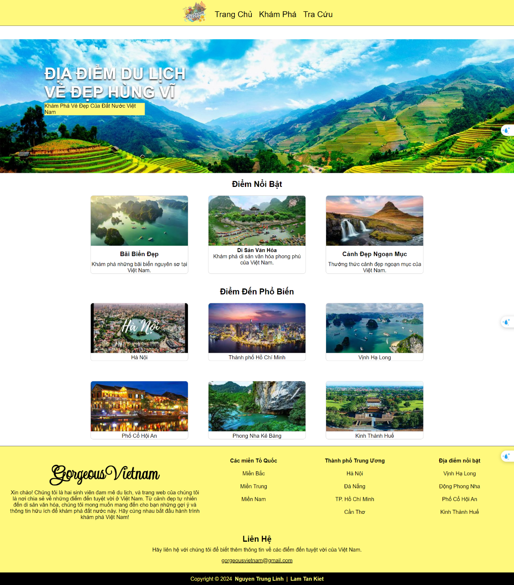
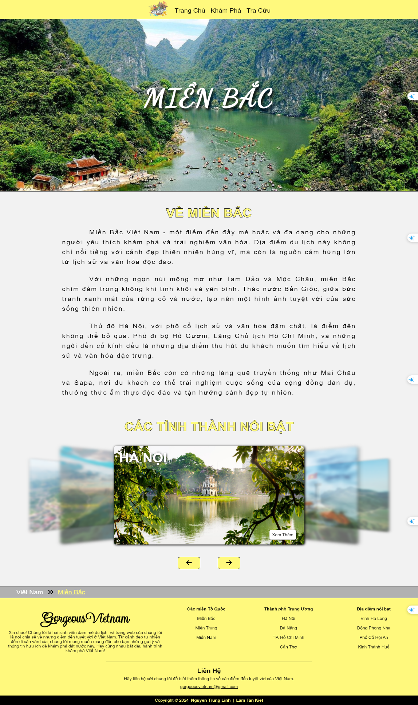
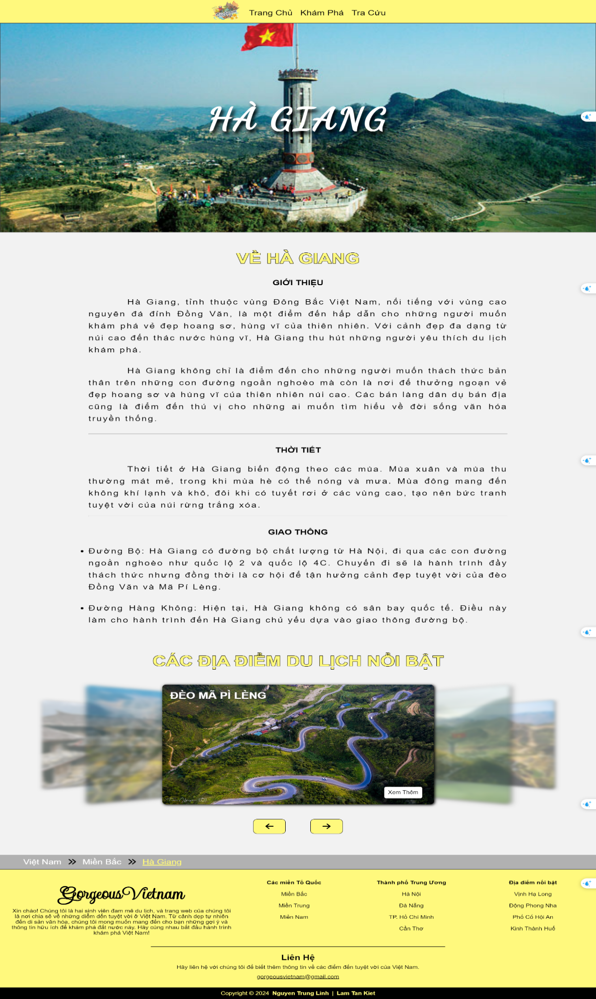

# 🌏 Vietnam Tourism Web App  

This is a simple web application that introduces a couple of famous tourism places in **Vietnam**.  
The project is built with **Django**, uses **PostgreSQL** as the database, and is containerized with **Docker**.  

---

## 🚀 Features
- Explore information about tourism places in Vietnam 🏞️  
- Backend powered by **Django**  
- Data persistence with **PostgreSQL**  
- Fully containerized using **Docker Compose**  

---

## 🛠️ Tech Stack
- **Frontend:** Django Template Engine (HTML, CSS, Javascript)  
- **Backend:** Django  
- **Database:** PostgreSQL  
- **Containerization:** Docker & Docker Compose 

---

## 📸 Demo
Here are some demo images of the app in action:

  
  
  

---

## ⚙️ Installation & Setup

1. **Clone the repository**
   ```bash
   git clone https://github.com/LinhNguyen411/VietnamTourism
   cd VietnamTourism
